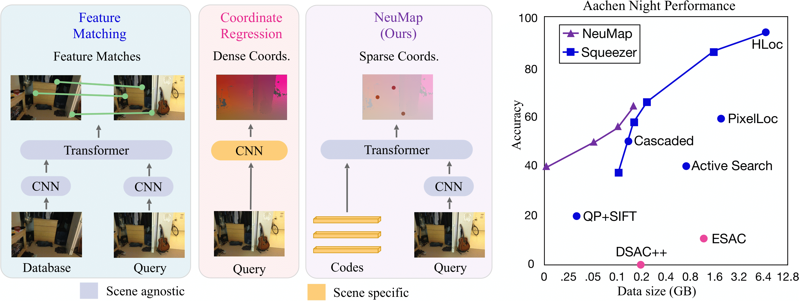

This repository contains codes for ["NeuMap: Neural Coordinate Mapping by Auto-Transdecoder for Camera Localization"](https://arxiv.org/abs/2211.11177).



If you find this project useful, please cite:
```
@inproceedings{Tang2022NeuMap,
  title={NeuMap: Neural Coordinate Mapping by Auto-Transdecoder for Camera Localization},
  author={Shitao Tang, Sicong Tang, Andrea Tagliasacchi, Ping Tan and Yasutaka Furukawa},
  journal={arXiv preprint arXiv:2211.11177},
  year={2022}
}
```

The codes are based on [LoFTR](https://github.com/zju3dv/LoFTR).

## Installation
```shell
# For full pytorch-lightning trainer features (recommended)
conda create --name neumap python=3.8
conda activate neumap
pip install -r requirement.txt
```

## Testing
- We provide testing codes and pretrained models for 7scenes, Cambridge, Aachen, NAVER LABS and ScanNet. Download the pretrained models in [Google Drive](https://drive.google.com/drive/folders/1LpkymcohcHb0FeL6ZfBtiNc2zTin-zOo?usp=share_link)/[Dropbox](https://www.dropbox.com/sh/o3htftym3e649cr/AABKn16WUN9VaZ3njqbpBEPZa?dl=0).

### Data
- The file structure should be like the following:
```
data
├── kapture
│   ├── train_list
│   ├── aachen1.0  
│   ├── HyundaiDepartmentStore
│   ├── GreatCourt
│   ├── chess
│   ...
├── scannet
│   ├── train_list
│   ├── train
```

### Aachen
We provide the processed data in [Google Drive](https://drive.google.com/file/d/1a-am7fk54EzcL-fGo6d7hFDV-lRA-e4K/view?usp=share_link)/[Dropbox](https://www.dropbox.com/s/qjjgfy2pcs3ka2x/aachen.tar?dl=0) and the label files in [Google Drive](https://drive.google.com/file/d/106uvy1b4hZK10rvUfoM6n5p8hNL2HVKw/view?usp=share_link)/[Dropbox](https://www.dropbox.com/s/7mszrb7iz44rg8z/aachen_label.tar?dl=0). Please submit the corresponding `pose.txt` file in the result directory to [this link](https://www.visuallocalization.net/) for evaluation.
```
bash scripts/reproduce_test/aachen_v10.sh
```

### 7scenes
We provide the processed data in [Google Drive](https://drive.google.com/drive/folders/1YBunSGt62OA-koBiFWSMoXENMyvYpYVA?usp=sharing)/[Dropbox](https://www.dropbox.com/scl/fo/xwxoj8f1ohihvz9l8crxs/h?dl=0&rlkey=vq1a6su2jwf9ox87ioiu16qvo) and the label files in [Google Drive](https://drive.google.com/file/d/1rU7NvFkUzfiNPT7zEPYBmlNLHavUBj4i/view?usp=sharing)/[Dropbox](https://www.dropbox.com/s/wth9vqx7xd52evj/7scenes_label.tar?dl=0).
```
bash scripts/reproduce_test/7scenes.sh
```

### Cambridge
We provide the processed data in [Google Drive](https://drive.google.com/drive/folders/1LMg5euGQIhP36wLL5tk4E879BjnA3BuX?usp=sharing)/[Dropbox](https://www.dropbox.com/scl/fo/l819h2hxrm2sk450gpx6x/h?dl=0&rlkey=fwziaglxv590ms2ph0d7lhnrh) and the label files in [Google Drive](https://drive.google.com/file/d/1wIbHjyWVNzQ9bPjQk828rH-5J0RdbaOA/view?usp=sharing)/[Dropbox](https://www.dropbox.com/s/mbmtgwrksdaymjc/cambridge_label.tar?dl=0).
```
bash scripts/reproduce_test/cambridge.sh
```

### NAVER LAB
We provide the processed data in [Google Drive](https://drive.google.com/drive/folders/1nznfL2bkZhBE31-sbVjcMLFGcXwqX5L1?usp=sharing)/[Dropbox](https://www.dropbox.com/scl/fo/30kh1oqun813e4uh933xa/h?dl=0&rlkey=5kwn8535koivmn3gpzh4nb0fv) and the label files in [Google Drive](https://drive.google.com/file/d/1XbQYQEuwsmKCNRui2JljS4A0UNkn2WLh/view?usp=sharing)/[Dropbox](https://www.dropbox.com/s/vh8ly50gfa8o0vd/store_label.tar?dl=0).
```
bash scripts/reproduce_test/store.sh
```

### ScanNet
We provide the testing data in [Google Drive](https://drive.google.com/file/d/1gFhHhw8nXpCvbm8KYnd59HprVpeeiWxh/view?usp=sharing)/[Dropbox](https://www.dropbox.com/s/r6vhr4fbzm3d5mh/scannet.tar?dl=0) and the label files in [Google Drive](https://drive.google.com/file/d/1W_ogXynFoKhL6qmGtEtjXCijwe_URQ-G/view?usp=sharing)/[Dropbox](https://www.dropbox.com/s/adh6bj0387n48ww/scannet_label.tar?dl=0).
```
bash scripts/reproduce_test/scannet.sh
```

## Training

### Aachen
First stage training
```
bash scripts/reproduce_train/aachen_v10_stage1.sh
```
Second stage training
```
bash scripts/reproduce_train/aachen_v10_stage2.sh
```

### 7scenes
First stage training
```
bash scripts/reproduce_train/7scenes_stage1.sh
```
Second stage training
```
bash scripts/reproduce_train/7scenes_stage2.sh
```

### Cambridge
First stage training
```
bash scripts/reproduce_train/cambridge_stage1.sh
```
Second stage training
```
bash scripts/reproduce_train/cambridge_stage2.sh
```

### NAVER LAB
```
bash scripts/reproduce_train/store.sh
```

### ScanNet
Train network
```
bash scripts/reproduce_train/scannet.sh
```
Finetune codes for new scenes
```
bash scripts/reproduce_train/scannet_code_finetune.sh
```

## Data size
To get data size, please refer to `tools/get_params.py` and `tools/get_params_cambridge.py`.

## Process data
We provide example codes to divide scenes to voxels and generate label files in `tools/get_label_file.py` and `tools/get_query_file.py`. 
```
python tools/get_label_file.py --root data/kapture -i aachen1.0/mapping -s 15 -o aachen_debug
```
Generate fake query images
```
python tools/get_query_file.py \
    -o query_regular_15 \
    --retrieval_path data/kapture/aachen1.0/pairs-query-netvlad30.txt \
    --root data/kapture \
    --train_list_path data/kapture/train_list/aachen_debug.txt
```
To run custom dataset, please first use r2d2 to generate key-points and triangulate 3D points with COLMAP. Then, convert the COLMAP output files to the same format as `data/kapture/aachen1.0/mapping/points`. 
